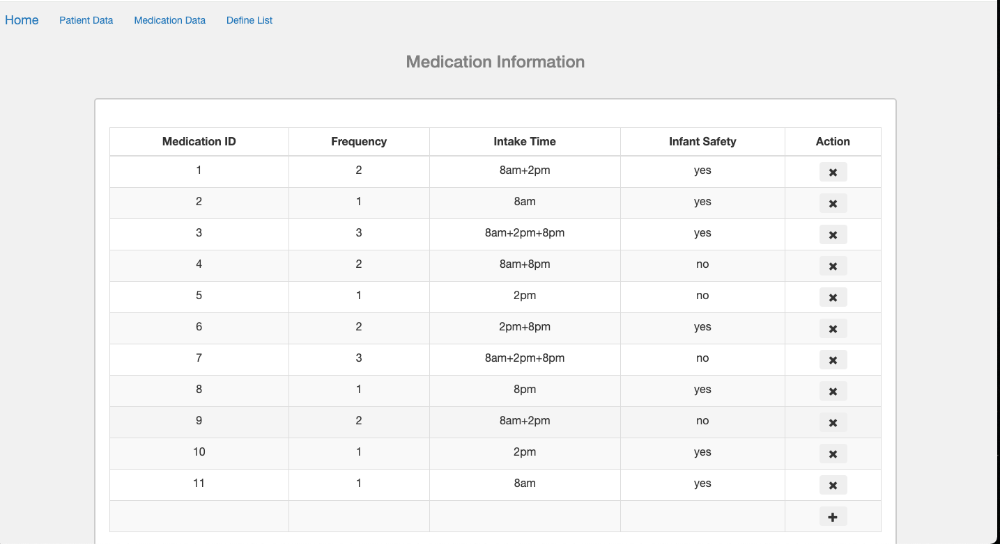

###################
PHP Web App Demo
###################

This repo contains sourcecode of a PHP web app demo using Codelgniter-AJAX-jQuery-Bootstrap. It follows a
MVC design pattern that decouples user-interface (View), data (Model) and controlling logic(Controller). This demo is used 
to define patients, medications and their intakes. Main functions include CRUD operation over patients and medications, login authentication and
defining list of patients and their medicines intake.


*******************
Installation and Setup
*******************
Prerequisites:

- macOS
- PHP version 5.6 or newer (my version is PHP 7.3)
- Codelgniter 3 (Please see the installation section <https://codeigniter.com/user_guide/installation/index.html> of the CodeIgniter User Guide.)
- SQLite3

To start this app demo locally, 

- git clone the repository
- open terminal, enter the target folder
- start the server and visit it via url: localhost:8000

            ```
            cd Php_Webapp
            php -S localhost:8000
            ```


*******************
Task
*******************

Tasks:

-  create some patients and medications
-  create a list of female adult patients and their medications for intake at 8 p.m.
-  create a list of male infant patients and their medications for intake at 8 a.m.

Optional:

-  only selected users can access the list of patients
-  create the list dynamically by selecting patients and intake times
-  list can be accessed via an API

*******************
Solution
*******************
**Database**: In SQLite3, I setup a schema named 'data' which contains three tables: 'patients', 'medicines' and 'users'.
For each table, I created some initial records.

Table 'patients': 10 records. Columns include id, gender and stage. See image below.


Table 'medicines': 10 records. Columns include med_ID, frequency, intake_time and infant_safety. See image below.

.. image:: img/data_medicines.png
   :width: 350


Table 'users': 2 records. Columns include userid and password. See image below.


**Login**: This is the default page when users start the app. Only authenticated users (with matched userid and password in the database) can visit medical data. This login authentication is a module in Codelgniter framework that utilizes session library to track user activities. The login part is done by accepting user data in the view, sending data to controller via POST, controller passing data to model, model checking if records match, model sending results back to controller and views redirecting to target page. In the mean time, by loading session library, it automatically checks the user status (check if user info exists in a session). See images below.


**CRUD**: The tables display real-time data fetched from database. With AJAX, users can create new records by inputting information in the bottom, then clicking on add button without reloading the whole page. To delete a record, similarly,users only need to click on the delete button on each row. See images below.


   


  


   


   

**Define List**: This is done by first querying two tables('patients' and 'medicines') with conditions from user end, then getting the cartesian product and printing all the possible combinations to the view. Addtionally, when it comes to infant, the result should exclude those medicines that are not infant-safe. Please check the following images for lists created for female adult patients with medicine intake at 8pm and male infant patients with intake at 8am.


   


  

**REST Api**: Controller manages all the http request and reponse via POST method. All the resources could be visited through a standard url.


*******************
File Structure
*******************
Database file path is ```/application/sqlite/data.db```. Main files are in ```application/models```, ```application/views``` and ```application/controllers```.  
For configuration, files are mainly in ```application/config```. Please look at the file structure below.


*******************
Video demo
*******************
If you have trouble running this app locally or would like to see how it works, please check the full details via this short video on Youtube through this link(https://youtu.be/AjylzFcd3OU). 

